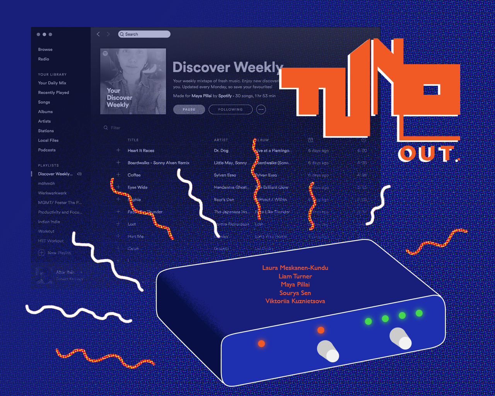

# tuneOut
Hardware radio that works with the spotify [web api](https://developer.spotify.com/web-api/)

## Installation

These examples run on Node.js. On [its website](http://www.nodejs.org/download/) you can find instructions on how to install it. You can also follow [this gist](https://gist.github.com/isaacs/579814) for a quick and easy way to install Node.js and npm.

Once installed, clone the repository and install its dependencies running:

    $ npm install

## Running the examples
In order to run the example, first add authenticate values.

- In https://beta.developer.spotify.com/dashboard/login register your app and paste the client_id, client_secret and redirect_uri values in app.js on line 25-27.
- open a spotify [web console](https://developer.spotify.com/web-api/console/get-current-user) and  press Get OAuth Token. In pop up window check all permissions in relevant and optional scopes and press Request token. Copy the generated token value and in app.js on line 30 replace YOUR_TOKEN with it. In the **response section** copy the id value (example "id" : "*************") and on line 43 replace YOUR_USER_ID
- open Spotify web console https://developer.spotify.com/web-api/console/get-users-available-devices/#complete and fetch the list of available devices. Select one that {"is_active" : true}, and copy the id. Paste the value to app.js on line 85, 163 instead of if YOUR_DEVICE_ID.
- Please follow the playlists that are listed in the array on lines 54-58.

- open the folder app, and run its `app.js` file in node. For instance do:

    $ cd app
    $ node app.js

## Important on node version
We are using [node-serialPort](https://www.npmjs.com/package/serialport) to access the serial port from the Arduino. In order to not have conflicts use node version 6. This is done by using node version manager [nvm](https://github.com/creationix/nvm). If you don't have it install it either on your own or by using a package manager like [brew](https://brew.sh/)

## Arduino code
Arduino (a Teensy 3.2 is being used here) code can be found in the hardware_code folder. There's no schematic as there was no time to draw it out, but the LEDpins and the AnalogIn code should make sense to anyone who's worked with hardware. There are two mappings going on so that there's no need to parse the data from node, playlists always stays between 0 - 100 && volume stays between 1001 - 2000. Pin 12 is just a status LED.

## 3D model
Found in 3d_model folder unzip and find a cool readme :) enjoy!
